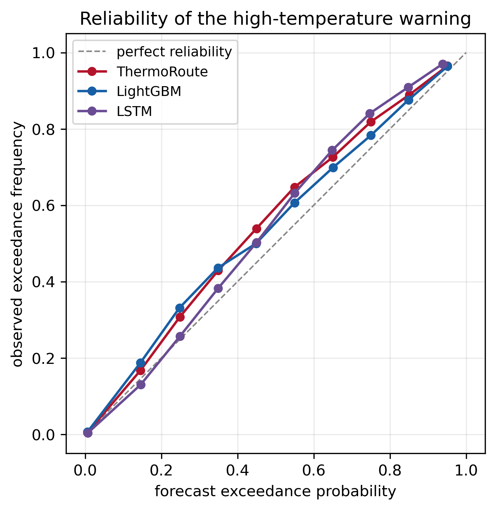

# Probabilistic + multi-metric verification

The same split-conformal (CQR) wrapper is applied to all three learners so the comparison is fair; ThermoRoute additionally carries the Proposition-1 safety floor and an interpretable lag router that a LightGBM/LSTM cannot.

## Calibrated probabilistic scores (90% intervals; CRPS lower = sharper)

| model | h | PICP | MPIW | CRPS | Brier skill | AUROC |
|---|---|---|---|---|---|---|
| ThermoRoute | 1 | 0.904 | 2.02 | 0.246 | +0.742 | 0.989 |
| ThermoRoute | 3 | 0.909 | 4.26 | 0.505 | +0.596 | 0.975 |
| ThermoRoute | 7 | 0.911 | 5.45 | 0.633 | +0.508 | 0.963 |
| LightGBM | 1 | 0.906 | 2.01 | 0.240 | +0.733 | 0.988 |
| LightGBM | 3 | 0.906 | 4.24 | 0.503 | +0.573 | 0.972 |
| LightGBM | 7 | 0.907 | 5.35 | 0.630 | +0.490 | 0.960 |
| LSTM | 1 | 0.905 | 2.15 | 0.258 | +0.683 | 0.985 |
| LSTM | 3 | 0.912 | 4.61 | 0.534 | +0.563 | 0.970 |
| LSTM | 7 | 0.912 | 5.98 | 0.688 | +0.481 | 0.957 |

## Multi-metric point scores (pooled blind test)

_Review Table-2 field norms: median RMSE≈1.35 °C, NSE≈0.93, MAE≈1.09 °C._

| model | h | RMSE | MAE | NSE | KGE | PBIAS | RMSE (region-wtd) |
|---|---|---|---|---|---|---|---|
| Persistence | 1 | 0.842 | 0.584 | 0.988 | 0.994 | +0.0 | 0.844 |
| Persistence | 3 | 1.642 | 1.179 | 0.954 | 0.977 | +0.0 | 1.687 |
| Persistence | 7 | 2.183 | 1.591 | 0.920 | 0.960 | +0.0 | 2.246 |
| DampedPersistence | 1 | 0.810 | 0.570 | 0.989 | 0.992 | -0.1 | 0.816 |
| DampedPersistence | 3 | 1.446 | 1.051 | 0.965 | 0.978 | -0.3 | 1.475 |
| DampedPersistence | 7 | 1.706 | 1.259 | 0.951 | 0.967 | -0.6 | 1.763 |
| LightGBM | 1 | 0.652 | 0.458 | 0.993 | 0.995 | -0.1 | 0.642 |
| LightGBM | 3 | 1.347 | 0.982 | 0.969 | 0.977 | -0.4 | 1.372 |
| LightGBM | 7 | 1.650 | 1.224 | 0.954 | 0.966 | -0.5 | 1.693 |
| LSTM | 1 | 0.687 | 0.489 | 0.992 | 0.994 | +0.2 | 0.675 |
| LSTM | 3 | 1.391 | 1.019 | 0.967 | 0.979 | +0.3 | 1.418 |
| LSTM | 7 | 1.764 | 1.318 | 0.947 | 0.968 | +0.5 | 1.807 |
| ThermoRoute | 1 | 0.668 | 0.470 | 0.992 | 0.993 | +0.1 | 0.661 |
| ThermoRoute | 3 | 1.335 | 0.971 | 0.970 | 0.974 | -0.0 | 1.373 |
| ThermoRoute | 7 | 1.645 | 1.213 | 0.954 | 0.963 | -0.2 | 1.692 |

