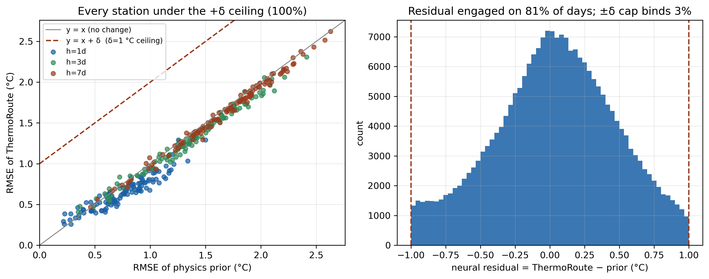

# Proposition 1 (bounded degradation) — empirical verification

The neural residual is tanh-bounded to ±δ around the physics prior, so per sample |median−y| ≤ |prior−y|+δ and per station RMSE(median) ≤ RMSE(prior)+δ (δ=1 °C). Verified on the seed-0 model's blind-test (2019–2020) predictions; the prior is the model's internal dynamic-relaxation prior, re-exported here.

- **Pointwise bound holds:** 100.00% of blind-test predictions satisfy |median−y| ≤ |prior−y|+δ (theory: 100%).
- **Per-station RMSE ceiling holds:** 100.0% of station×horizon cells have RMSE(median) ≤ RMSE(prior)+δ.
- **The residual is genuinely working, not decorative:** it is engaged (non-zero) on 81% of blind-test samples, while the ±δ safety cap only has to bind on 3% — δ=1 °C is a hard worst-case ceiling that rarely needs to intervene, so it constrains a real, active residual without distorting the forecast.
- **Floor survives out-of-region transfer:** on the leave-HUC2-region-out held-out stations, ThermoRoute still beats persistence at 91% of station×horizon cells — the worst-case floor is not an in-sample artifact.

This is the deployment property pure learners (LightGBM/LSTM) and even differentiable-hybrid models (Rahmani 2023 dPL) do not state: a per-station, worst-case skill floor that provably holds on unseen years and survives spatial extrapolation.

